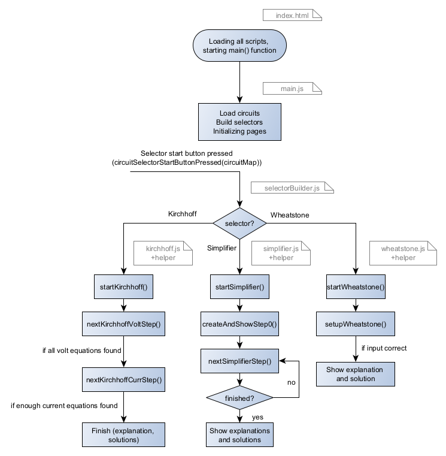

# Start

## How the frontend is structured

If you cloned the simplipfy repository from [gitlab](https://gitlab.hs-pforzheim.de/stefan.kray/inskale.git), you
will have an ```inskale``` directory, that contains:

- **lcapy-inskale**: Adapted lcapy library
- **Schemdraw**: Adapted schemdraw library
- **simpliPFy**: Backend API for simplipfy 
- **Pyodide**: Frontend functionality

So in this documentation, we will focus on the **Pyodide** directory, which contains the frontend code for simplipfy.
If you want to see more information on the backend, navigate to the simplipfy documentation.

The **Pyodide** directory contains the following subdirectories:

- Circuits: Containing the .txt, .svg and .json files for the circuits
- Circuits.zip: The above Circuits directory in a zip file
- Circuits_example: Example circuits for the user to download under "Custom Circuits"
- Packages: All necessary Python packages for the backend
- Scripts: Some development scripts
- **src: The source code for the frontend**
- various files

The **src** directory contains the following subdirectories:

- conf: Directory containing conf.json to specifics paths and names
- docs: The documentation for the frontend
- fonts: Directory containing the fonts used in the frontend
- resources: Directory containing the resources used in the frontend (Images, Icons, etc.)
- **scripts: Directory containing the scripts used in the frontend**
- **styles: Directory containing the styles used in the frontend**
- tutorials: Directory containing the tutorials for the frontend documentation
- jsdoc.json and readme.md for documentation 

## The scripts directory

The **scripts** directory contains the following subdirectories:

- applications: Directory containing the applications (simplifier, kirchhoff, wheatstone, ...) for the frontend
- dataObjects:
  - stateObject.js: Definition of the state object that is used to store the state of the frontend
  - stepObject.js: Containing the definitions for step objects received from the backend
- dataPrivacyAndLegalNotice: 
  - dataPrivacy.js: Setup function for data privacy page
  - legalNotice.js: Setup function for legal notice page
- definitions:
  - allowedCircuitDirectories.js: Specifying the allowed circuit directory names
  - colorDefinitions.js: Defining the colors used in the frontend for easy access
  - emojis.js: Defining the emojis used in the frontend (try to incorrectly solve a circuit if you want to see one)
  - romanNumbersMap.js: Mapping of roman numbers to numbers (for Math equations)
  - toggleSymbolDefinition.js: Defining the toggle symbol used in the frontend (toggle between symbol and value)
- extern: Containing the external libraries used in the frontend (downloaded to be hosted here instead of using cdn to avoid cookie issues)
- languages:
  - de (Directory containing the German translations)
  - en (Directory containing the English translations)
  - languageManager.js
- pyodideAPI (see more in the pyodideWorker tutorial):
  - hardcodedStepSolverAPI.js: Hardcoded step solver so no backend necessary for this
  - kirchhoffSolverAPI.js: Kirchhoff solver API
  - pyodideAPI.js: Pyodide API for the frontend
  - pyodideWorker.js: The webworker that handles the pyodide instance
  - pyodideWorkerAPI.js: The webworker API that is called from the frontend
  - stepSolverAPI.js: Step solver API (for the basic simplification steps)
  - wheatstoneSolverAPI.js: Wheatstone solver API
  - workerAvailability.js: Script that checks if the webworker is available on the device
- utils
  - circuitMapper.js: For loading the circuits and generating usable circuit objects
  - configurations.js: Handler for the conf.json file
  - darkModeFunctions.js: Functions for dark mode handling
  - loadFonts.js: Function for loading the fonts used in the frontend
  - matomoHelper.js: Functions for Matomo tracking
  - packageManager.js: Functions for managing the Python packages used in the frontend
  - pageManager.js: Functions for managing the "navigator", i.e. the different used pages
  - selectorBuilder.js: Functions for dynamically building the selectors (carousels, ...) used
- main.js: The main script that is loaded in the index.html file and initializes the frontend

## Program flow


