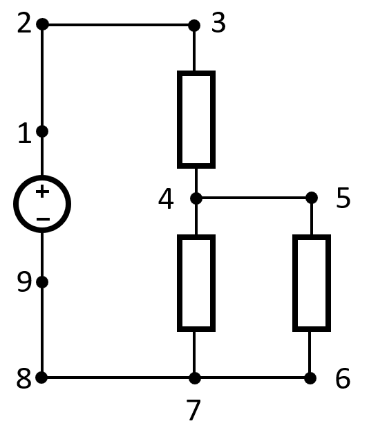

# Table of Content
1. [Setup local git copy](#setup-local-git-copy)
2. [Structure](#structure)
3. [Set up local Python interpreter](#set-up-local-python-interpreter)
   1. [install modified lcapy and schemdraw](#install-modified-lcapy-and-schemdraw)
   2. [Required Packages](#required-packages)
4. [Build Packages](#build-packages)
5. [Host SimpliPFy generally](#host-simplipfy-generally)
5. [Host SimpliPFy locally](#host-simplipfy-python)
6. [Host SimpliPFy GitHub Page](#host-simplipfy-github-page)
   1. [Most recent version](#most-recent-version-nightly)
   2. [More stable version](#more-stable-version-stable)
7. [Host own circuit files](#host-own-circuit-files)
7. [Write netlists](#write-netlists)
   1. [Draw hints](#draw-hints)
   2. [Supported components](#supported-components)
   3. [Component W](#component-w)
   4. [Components R, L, C, Z](#components-r-l-c-z)
   5. [Sources](#sources)
   6. [Convert a circuit to a netlist](#convert-a-circuit-to-netlist)
8. [Used libraries](#used-libraries)
9. [Common Issues & Fixes](#common-issues--fixes)

# Current release
[simpliPFy.org](https://simplipfy.org)

# Setup local git copy
```
git clone --recursive https://github.com/prof-sky/simplipfy.git
```
the `--recursive` keyword is important, to clone the submodule lcapy-inskale
# Structure
There are three folders inside the simplipfy Project.
- lcapy-inskale: is a submodule that includes a fork of the lcapy GitHub repository to merge changes and updates easily.
The submodule has to branches, the master which is the same as the fork from original repository and the lcapy-inskale
branch which hold the modifications for this project. 
- Pyodide: includes all files that are needed to host pyodide and execute the lcapy package in a browser to simplify
circuits
- Schemdraw: a slightly modified version of the Schemdraw package

# Set up local Python interpreter
This is only neccessary to develop or test the lcapy or schemdraw package. If you only want to host simplipfy locally jump to [Host simplipfy locally](#host-simplipfy-locally).
## install modified lcapy and schemdraw
```
cd .\path\to\simplipfy-git-repo\simplipfy
pip install -e .\lcapy-inskale
pip uninstall schemdraw
pip install -e .\schemdraw
```
the `-e` keyword is only necessary if you want to automatically apply changes to the packages without
reinstalling them or modify them yourself

## Required packages
The lcapy package needs:
- matplotlib
- numpy
- sympy>=1.10.1
- networkx
- IPython
- setuptools
- wheel
- property_cached
- (schemdraw) don't download package from pypi
- ordered_set

for testing:
- pytest
- flake8
- flake8-bugbear
- flake8-comprehensions
- flake8-requirements

for releasing:
- wheel
- twine

The schemdraw package needs:
- matplotlib>=3.4
- ziafont>=0.8
- ziamath>=0.10
- latex2mathml

Some IDEs read the `setup.py` and `setup.cfg` and offer to auto install needed packages.
The necessary packages should be installed from the step before, so don't install them by hand.

# Build packages
in each package folder is a `buildPackage.ps1`. Those files build the package and in case
of the lcapy-inskale package it also tests it before it gets build. The new build package is modved
to Pyodide/Packages and the Pyodide/solve.py is updated automatically and annotated with the current
Package version

# Host SimpliPfy generally
To host SimpliPFy you need a webserver that serves the files that are found in [simplipfy/Pyodide](https://github.com/prof-sky/simplipfy/tree/main/Pyodide).
If you start a webserver in this folder, SimpliPFy would work for everyone accessing the server address from a browser.


# Host SimpliPFy python
To host simplipfy locally with python you only have to go to the Pyodide Folder and execute `StartServer.ps1`
found at [simplipfy/Pyodide/Scripts](https://github.com/prof-sky/simplipfy/tree/main/Pyodide/Scripts) this executes a simple http server
integrated with Python. It executes it from a script called `GzipSimplePythonHttpServer.py` to support Gzip compression
for .whl-Files. simplipfy is then hosted on `http:\\localhost:8000`. It is important to go to `http:\\` and not `https:\\` 
because the simple http server does not support the https protocol 
(However if you host it from a https server the https protocol is supported). For an integration into an IDE the
`StartServerProcess.ps1` and `StopServerProcess.ps1` may be helpful. `StartServerProcess.ps1` starts a process and
retrieves the process id and saves it into `server.pid`, which `StopServerProcess.ps1` uses to stop the process if the
process is still running. `StartServerProcess.ps1` calls `StopServerProcess.ps1` when `server.pid` is in the directory.
Some IDEs can be configured to execute a skript before executing code so the Server can be started before the IDE 
accesses `http:\\localhost:8000` to debug and test simplipfy.

# Host SimpliPFy GitHub Page
## Most recent version (nightly)
To host via GitHub Pages go to [simplipfy nightly](https://github.com/prof-sky/simplipfy/tree/main) for the most recent 
version and fork it to your own account under a name that fits for you. Note that the most recent version is more likely
to contain unknown bugs but might fix bugs you encountered in earlier versions. Clone the repository onto your PC and
configure the GitHub Page with the commands:
```
git clone https://<yourGHUserName>/<repositoryName>.git
git submodule init
git submodule update --recursive --remote
git subtree push --prefix Pyodide origin gh-pages
```
After GitHub finished the Page build process your self-hosted version of SimpliPFy is available under `<yourUserName>/github.io/<repositoryName>`
or simply use the link on the main page of your repository under `deployments`. 

## More stable version (stable)
More stable releases are found here [simplipfy stable](https://github.com/prof-sky/simplipfy/releases).
Choose the most recent tag and download the source code. Place the folder where you want it and extract it. Navigate
into the folder within your file system. Navigate into the subfolder Pyodide (\<pathToSourceCode\>/\<extractedSourceCodeFolder\>/Pyodide).
Then push the contents of the Pyodide folder into a new repository on your GitHub account. This can be achieved by following those git commands:
```
<be in Pyodide folder from downloaded source code>
<open git bash and type following comands>
git init -b main
git add .
git commit . -m "self host simplipfy"
git remote add origin <repo addres e.g. https://github.com/<yourGHUserName>/<yourProjectOnGH>.git>
git push origin main
```
Go to your repository on GitHub and navitgate to `Settings (Repository Settings)`. There choose the submenu `Pages`. 
Under `Build and deployment` set `Source` to `Deploy from branch` and configure `Branch` to `main/root` and save.
After GitHub finished the Page build process your self-hosted version of SimpliPFy is available under `<yourUserName>/github.io/<repositoryName>`
or simply use the link on the main page of your repository under `deployments`.

# Host own circuit files
See [write netlist](#write-netlists) to learn how circuit files should look.
Create circuit files that end with .txt and sort them into Circuits/:
- capacitor (circuits with only capacitors)
- inductor (circuits with only inductors)
- mixed (circuits with a mix of capacitors, inductors, resistors)
- quickstart (circuits that shall be shown at the top as a preview selection)
- resistor (circuits with only resistors)
- symbolic (circuits that have variables (R1, C1, L1, V1) as values (resistance, capacitance, voltage etc.))
this only makes sense for small circuits and is likely to crash for capacitors and inductors

Open a PowerShell. Create a python virtual venv with `python -m venv ./circuitsGenVenv` (this creates the venv in the directory
you are currently in). The venv has to be at least Python 3.8. Activate the venv with `.\circuitsGenVenv\Scripts\Activate.ps1`.
From [simplipfy packages](https://github.com/prof-sky/simplipfy/tree/main/Pyodide/Packages) download:
- lcapy
- schemdraw

If you are on a stable version take the packages from your download `<SourceCodeFolder>/Pyodide/Packages`
and save them where you created the venv. Alternatively you can replace `.\` with `path\to\packages\` and save
them wherever you want. Then run in Powershell:
```
pip install .\lcapy-<version>-none-any.whl
pip install .\schemdraw-<version>-none-any.whl
```
It is important to first install lcapy then install schemdraw.  
Navigate into to <sourceCode>/Pyodide or simply Pyodide (you should see e.g. the folders Circuits, Packages, Scripts).
With the active venv execute 
```
.\Scripts\generateSVGFiles.ps1
```
This might take some time and should produce output that looks like this:
```
generating: Circuits\capacitor\00_capacitor_row3.svg
generating: Circuits\capacitor\01_capacitor_parallel3.svg
generating: Circuits\capacitor\07_capacitors_mixed_simple.svg
...
```
Now you have to zip the new circuits folder, commit and push your changes to GitHub. Don't forget to update your 
gh-pages branch with `git subtree push --prefix Pyodide origin gh-pages` if you forked the repository, otherwise the
changed circuits will not be on your GitHub Page. If you downloaded the source code, pushing to the main branch of
your repository will trigger the GitHub Page build. If you serve them via a http(s) server, simply overwriting the 
Circuits.zip file will yield the new files on the webserver.
# Write netlists

## Draw hints
possible draw hints are `right, left, up, down`

## Supported components
Supported components are: `W, R, L, C, Z, V` for Wire, Resistor, Inductor, Capacitor, Impedance, Voltage source

## Component W
A netlist line with the component `W` contains:
```
W<identifier> <start node> <end node>; <drawing hint>
```
the identifier is optional so it could  be:
```
W1 1 2; left
W 1 2; left
```
The length of a wire is always one unit and therefore the same as a Resistor or any other element. If you want to close the circuit
the number of wires has to be adjusted to fit the length of elements.

## Components R, L, C, Z
A netlist line with `R, L, C or Z` always contains:
```
<component typy><identifier> <start node> <end node> {<value>}; <drawing hint>
```
e.g.
```
R1 1 2 {1000}; left
```
the value is encapsulated in `{}` to ensure that it is parsed correctly there are situations where the brackets can be
ignored, but it is easiest to always use brackets to avoid parsing errors. The start and end node always has to be
an integer. The identifier has to be unique across the components R, L, C, Z because they are transformed internally
into impedances e.g. R1, C2, L3, L4 not R1, C1, L1, L2

## Sources
(07.10.24 current sources don't work yet)
Sources have additional arguments. The DC source is defined as follows:
```
<component typy><identifier> <start node> <end node> dc {value}; <drawing hint>
```
with dc it create a dc source of type `V, I` for voltage- or current Source
e.g.
```
V1 0 1 dc {10}; up
```
The AC source is defined as follows:
```
<component typy><identifier> <start node> <end node> ac {value1} {value2} {value3}; <drawing hint>
```
`{value1}` is the current or voltage of the source, `{value2}` is the phase of the source,
and `{value3}` is the value for omega. Supported is `<value>`, `2*pi*<value for f> ` or `omega_0`. e.g.
```
V1 1 0 ac {10} {0} {100}; up
V1 1 0 ac {10} {0} {2*pi*30}; up
V1 1 0 ac {10} {0} {omega_0}; up
```
## Convert a circuit to netlist
Start by finding the start and end nodes for components. The easiest way is to draw the circuit on paper and then
mark the start and end point of each component. Enumerate the points. Now you can see the start and end nodes for
each component.
  
Represented as a netlist the circuit in the picture would be:
```
V1 1 9 dc {10}; up
W 1 2; up
W 2 3; right
R 3 4 {100}; down
R 4 7 {100}; down
W 4 5; right
R 5 6 {100}; down
W 6 7; left
W 7 8; left
W 8 9; up
```
the values of the components are chosen randomly.
Best draw from plus to minus of the voltage source otherwise current and voltage arrows may be wrong
due to schemdraw limitations. The direction of the source should be the opposite of the direction of the components
(e.g. V -> up; R -> down | V -> right; R -> left).  
The netlist structure is adapted from lcapy and has great documentaion. There are two limitations introduced by our implementation.
- no auto naming of components
- component values have to be enclosed in {}
Examples can be found in Pyodide/Circuits

# Used libraries
- Lcapy (adapted) [LGPL-2.1 license]
- SchemDraw (adapted) [MIT license]
- Pyodide [MPL-2.0 license]

# Common Issues & Fixes
If you encounter an error copy it into the search bar (strg+f). Error messages are fully written in this section this
should make them searchable.
to find them.
## error: 'lcapy-inskale' does not have a commit checked out
The git error when trying to push into the remote repository
```
error: 'lcapy-inskale' does not have a commit checked out
fatal: updating files failed
```
is caused by the uninitialized submodule lcapy-inskale
run the following git commands to solve this issue
```
git submodule init
git submodule update --recursive --remote
```
